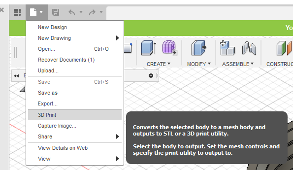
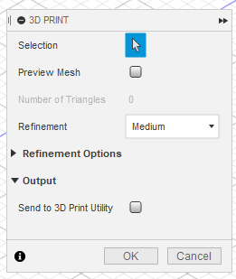

# CAD Software

User guide for 3D printing objects from CAD software.

## Export a Tinkercad Design

1. Click **Export**
2. Select what to include
3. Select **.STL**

## Export a Fusion 360 Design

1. Click  **> 3D Print**

    

2. Select the body to 3D print

    !!! note
        The object to be printed must be one **complete** body.

4. Uncheck **Send to 3D Print Utility**

    

5. Click **OK**
6. Save The STL file
