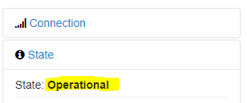

# OctoPrint

## Check the printer connection status

1. Look under **State:**

    

## Connect to Wi-fi

1. SSH to the Raspberry Pi

    !!! tip
        Alternatively:

        1. Shutdown the Raspberry Pi
        2. Insert the SD card into a computer
        3. A drive should show up. Open the file **octopi-wpa-supplicant.txt**

2. Open the file **/boot/octopi-wpa-supplicant.txt** with a text editor and root privileges
3. Add the following lines to connect to Wi-Fi.

        network={
            ssid="VSB-Commons"
            psk="<password>"
        }

    !!! tip
        The above lines may already be in the file but commented out.
        Simply remove the **#** from the beginning of the line.