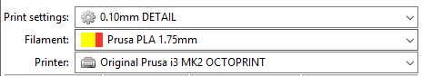
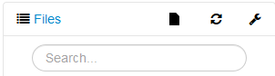

# Prusa i3

User guide for the Prusa i3 MK2S 3D printer.

## Step-by-step 3D printing guide.
This section will take you through the complete process of downloading an object to 3D printing the object.

1. Download or export the object that you want to print in STL format.
2. Open Slic3r
3. Drag the STL file into the main area.
4. Orient your object by right clicking on it and using the rotate options
5. Select the desired level of detail (layer height)
6. Select the type of filament to be printed on
    
7. Optionally enable a brim or supports. Refer to relevant sections.
8. Click send to printer
9. Open OctoPrint
10. Find the gcode file in the Files window

    !!! note
        The gcode file name is based on the STL file name.

    

11. Ensure the bed of the printer is clear, and ready for printing.
12. Ensure that the correct type of filament, and a sufficient amount to complete the print is loaded.
13. Click Print

## Changing the filament

1. Home the hotend by going to the **Control** tab, then clicking the  under Z.
2. Centre the hotend by clicking **Centre Hotend** under the **Control** tab.
3. Heat the hotend to a temperature hot enough to remove the old filament, and to insert the new filament.
4. Unload the old filament:

    === "Using OctoPrint"

        1. Under the **Control** tab, enter the length in mm to retract
        2. Click retract

    === "Using the printer firmware"

        1. Click the wheel
        2. Select **Unload filament**
        3. Click the wheel

5. Load the new filament:

    === "Using OctoPrint"

        1. Under the **Control** tab, enter the length in mm to extrude

            !!! note
                100mm-120mm is usually sufficient

        1. Click extrude.

            !!! tip
                If the colour isn't clear, keep extruding by small amounts until the colour is clear.

    === "Using the printer firmware"

        1. Click the wheel
        2. Select **Load Filament**
        3. Follow the prompts to ensure that the colour is clear

6. Done